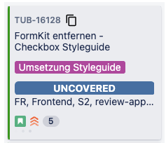

# jira-branch-copy-extension

## Installation
- Simply download a zip of the repo and unzip it on your computer.
- **Open [the extensions page](chrome://extensions)** in your browser: `chrome://extensions`. This link works on any chromium-based browser.
- If you did not do it already, **toggle the "developer mode"**. This is usually a toggle button at the top right of the extensions page.
- Click the button **_load unpacked extension_**.
- In the window that pops up, **select the folder that contains this minimal extension**, then **click _ok_**.
- **Done!**
